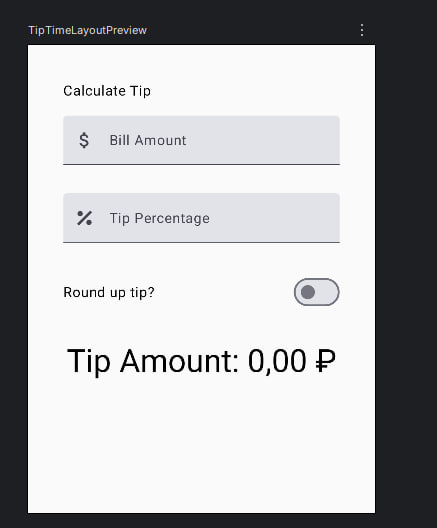

# Tip Time - Лабораторная работа №6-7

## Студент - Лойко Арина Станиславна, группа ИСП-232

## Описание

Приложение для расчёта чаевых на Android с использованием Jetpack Compose

## Скриншот

## Функциональность

- Ввод суммы счёта и процента чаевых
- Автоматический подсчёт суммы чаевых
- Возможность округления чаевых вверх
- Поддержка прокрутки в горизонтальной ориентации

## Технологии

- Jetpack Compose
- Material Design 3
- State Hoisting
- Unit-тесты и UI-тесты

## Как запустить

Открыть проект в Android Studio и запустить на эмуляторе или устройстве
